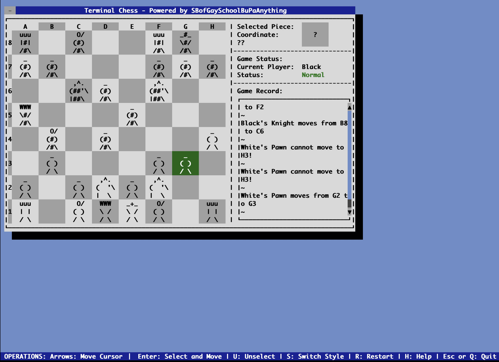

# Terminal Chess

A terminal-based chess game with a simple cli UI and a terminal UI with Library
[FinalCut](https://github.com/gansm/finalcut) applied.

### 1. Background
As a part of Integrated Programming Laboratory (CO550) in Imperial College London, students are instructed to implement
a program to simulate the procedure of a chess game (without castling, en-passant and promotion) using OOP thinking
(see [spec pdf](resource/spec-550-3-0.pdf)).<br>
However, as the the implementation of such simulation core does not have enough fun, I then largely upgraded my
coursework with full chess rules implemented and generate two kind of terminal UI, turning the coursework into a 
terminal chess game which can be played with fun.

### 2. Compile
```
git clone https://github.com/ComradeStukov/TerminalChess.git
cd TerminalChess
make libs
make all
```

### 3. Usage - chess
This part of the program is implemented only to cover the original object of the coursework it self.<br>
Run the program by the command:
```
./chess
```
And the result will come out.<br>
It might also be usedful to use this part to verify the correct implementation of the program.

### 4. Usage - gamecli
This part of the program provides a simple cli interface of the chess game in gnu-chess-like style.<br>
Run the program by the command:
```
./gamecli
```
Symbols in the program are:
 - <b>P & p</b> - Pawn, <b>R & r</b> - Rook, <b>N & n</b> - Knight
 - <b>B & b</b> - Bishop, <b>Q & q</b> - Queen, <b>K & k</b> - king
 - <b>UPPER ALPHA</b> - WHITE, <b>lower alpha</b> - black
 
Available options in the program are:
 - <b>SRC DST</b>: Move the piece at SRC to DST, e.g. D2 D4.
 - <b>Promotiong Type</b>: Promote a pawn to the designated type. The type must be one of the following four: queen,
 rook, knight, bishop.
 - <b>help</b>: Show available options.
 - <b>restart</b>: Restart the game.
 - <b>quit</b>: Quit the program.
 
A typical game looks like:
```
...
====================
  New Game Started  
====================

A new chess game is started!

Current Player: White
Status: Normal
Promoting: None

  A B C D E F G H  
 +-+-+-+-+-+-+-+-+ 
8|r|n|b|q|k|b|n|r|8
 +-+-+-+-+-+-+-+-+ 
7|p|p|p|p|p|p|p|p|7
 +-+-+-+-+-+-+-+-+ 
6| | | | | | | | |6
 +-+-+-+-+-+-+-+-+ 
5| | | | | | | | |5
 +-+-+-+-+-+-+-+-+ 
4| | | | | | | | |4
 +-+-+-+-+-+-+-+-+ 
3| | | | | | | | |3
 +-+-+-+-+-+-+-+-+ 
2|P|P|P|P|P|P|P|P|2
 +-+-+-+-+-+-+-+-+ 
1|R|N|B|Q|K|B|N|R|1
 +-+-+-+-+-+-+-+-+ 
  A B C D E F G H  

D2 D4

White's Pawn moves from D2 to D4

Current Player: Black
Status: Normal
Promoting: None

  A B C D E F G H  
 +-+-+-+-+-+-+-+-+ 
8|r|n|b|q|k|b|n|r|8
 +-+-+-+-+-+-+-+-+ 
7|p|p|p|p|p|p|p|p|7
 +-+-+-+-+-+-+-+-+ 
6| | | | | | | | |6
 +-+-+-+-+-+-+-+-+ 
5| | | | | | | | |5
 +-+-+-+-+-+-+-+-+ 
4| | | |P| | | | |4
 +-+-+-+-+-+-+-+-+ 
3| | | | | | | | |3
 +-+-+-+-+-+-+-+-+ 
2|P|P|P| |P|P|P|P|2
 +-+-+-+-+-+-+-+-+ 
1|R|N|B|Q|K|B|N|R|1
 +-+-+-+-+-+-+-+-+ 
  A B C D E F G H  

C7 C5

Black's Pawn moves from C7 to C5

Current Player: White
Status: Normal
Promoting: None

  A B C D E F G H  
 +-+-+-+-+-+-+-+-+ 
8|r|n|b|q|k|b|n|r|8
 +-+-+-+-+-+-+-+-+ 
7|p|p| |p|p|p|p|p|7
 +-+-+-+-+-+-+-+-+ 
6| | | | | | | | |6
 +-+-+-+-+-+-+-+-+ 
5| | |p| | | | | |5
 +-+-+-+-+-+-+-+-+ 
4| | | |P| | | | |4
 +-+-+-+-+-+-+-+-+ 
3| | | | | | | | |3
 +-+-+-+-+-+-+-+-+ 
2|P|P|P| |P|P|P|P|2
 +-+-+-+-+-+-+-+-+ 
1|R|N|B|Q|K|B|N|R|1
 +-+-+-+-+-+-+-+-+ 
  A B C D E F G H  
...
```

### 5. Usage - gameui
This is the actual playable part of the program, as the chess game is fully implemeneted on a user-friendly terminal UI
using open source library FinalCut.<br>
Run the program by the command
```
./gameui
```
Symbols and operations inside the game is very simply and straight forawrd.
```
+--------+---------+---------+    +-------+----------------------+
|        |  White  |  Black  |    |  Key  |      Operation       |
+--------+---------+---------+    +-------+----------------------+
|        |    _    |    _    |    |  Up   |  Move up the cursor  |
|  Pawn  |   ( )   |   (#)   |    +-------+----------------------+
|        |   / \   |   /#\   |    |  Down | Move down the cursor |
+--------+---------+---------+    +-------+----------------------+
|        |   uuu   |   uuu   |    |  Left | Move left the cursor |
|  Rook  |   | |   |   |#|   |    +-------+----------------------+
|        |   / \   |   /#\   |    | Right | Move right the cursor|
+--------+---------+---------+    +-------+----------------------+
|        |   ,^.   |   ,^.   |    |       |If no piece selected, |
| Knight |  (  '\  |  (##'\  |    | Enter |  Select the cursor   |
|        |  |  \   |  |##\   |    |       |Else, Submit movement |
+--------+---------+---------+    +-------+----------------------+
|        |    O/   |    O/   |    |   U   | Unselected the piece |
| Bishop |   ( )   |   (#)   |    +-------+----------------------+
|        |   / \   |   /#\   |    |   S   |Switch the piece style|
+--------+---------+---------+    +-------+----------------------+
|        |   WWW   |   WWW   |    |   H   | Open the help window |
|  King  |   \ /   |   \#/   |    +-------+----------------------+
|        |   / \   |   /#\   |    |   R   |   Restart the game   |
+--------+---------+---------+    +-------+----------------------+
|        |   _+_   |   _#_   |    |   Q   |                      |
|  Queen |   \ /   |   \#/   |    +-------+   Quit the program   |
|        |   / \   |   /#\   |    |  ESC  |                      |
+--------+---------+---------+    +-------+----------------------+
```
A typical game looks like:<br>


### 6. Acknowledgement
 - <b>License</b>: This program is published under GNU Lesser General Public License Version 3.
 - <b>Author</b>: SBofGaySchoolBuPaAnything<br>
 (Used Name: Eshttc_Cty, ComradeStukov; College User Name: tc2819)<br>
 - <b>Contact</b>: Any bugs, issues, questions or suggestions please send to author's private email: 1532422769@qq.com,
 or official college email: tc2819@ic.ac.uk;